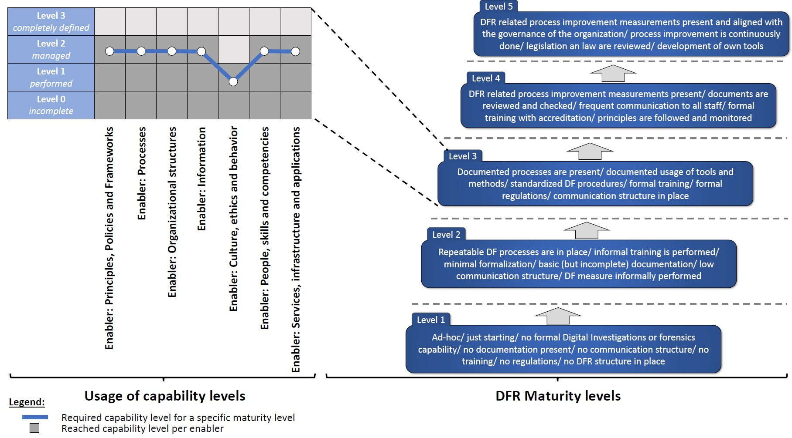

# A web-based Digital Forensic Readiness Check

This is a web-based application to determine the maturity level of a company regarding Digital Forensic Readiness. The theoretical basis for this tool can be found in the paper with the title "Towards a Capability Maturity Model for Digital Forensic Readiness".

The tool determines the level of certain capabilities in an organization based on the seven COBIT 5 enablers and derives a maturity level from this. The following graphic illustrates the concept for evaluating the implemented measures for digital forensic readiness



**On the basis of this evaluation, specific measures can be initiated to make a company Digital Forensic ready.**
 

## Prerequisites and installation

In order to host and run the web-based Digital Forensics Readiness Check you first need to install the following two softwares:

* [Webserver with PHP-Support (e.g.: Apache)](https://httpd.apache.org/)
* [MySQL Database](https://www.mysql.com/downloads/                )
* [Browser with JavaScript support (e.g.: Chrome)](https://www.google.com/chrome/           )
 
 
### Steps to get started

* Copy the files within **/dfrweb/** into your web-root directory
* Execute the SQL-queries within **/dfr.sql** (This script creates a new database at your MySQL Server)
* Adjust **/dfrweb/api.php** according your MySQL-database account credentials

* Open http://[yourdomain]/dfrweb/start.html in your browser

 
## Theoretical background

* ["Towards a Capability Maturity Model for Digital Forensic Readiness"](https://www.researchgate.net/publication/330077045_Towards_a_capability_maturity_model_for_digital_forensic_readiness): Extended Journal Version [(DOI)](https://doi.org/10.1007/s11276-018-01920-5)

* ["Towards a Capability Maturity Model for Digital Forensic Readiness"](https://www.researchgate.net/publication/330517032_Toward_a_Capability_Maturity_Model_for_Digital_Forensic_Readiness): Short Version [(DOI)](https://doi.org/10.1007/978-3-030-03898-4_10)

## Citing the Digital Forensic Readiness Check

To cite the Digital Forensic Readiness Check in academic papers, please use the following BibTeX entry.

```
@Article{Englbrecht2019,
    author="Englbrecht, Ludwig
    and Meier, Stefan
    and Pernul, G{\"u}nther",
    title="Towards a capability maturity model for digital forensic readiness",
    journal="Wireless Networks",
    year="2019",
    month="Jan",
    day="01",
    issn="1572-8196",
    doi="10.1007/s11276-018-01920-5",
    url="https://doi.org/10.1007/s11276-018-01920-5"
}
```


 
## Contact details

E-Mail: Ludwig.Englbrecht@wiwi.uni-regensburg.de

Twitter: [LJESec](https://twitter.com/LJESec)


## Used third-party software

* [jQuery](https://jquery.com/) 
* [Bootstrap](https://getbootstrap.com/)
* [Bootswatch](https://bootswatch.com/)
* [wheelnav](http://wheelnavjs.softwaretailoring.net/) [wheelnav on GitHub](https://github.com/softwaretailoring/wheelnav)


## License

This project is licensed under the MIT License
